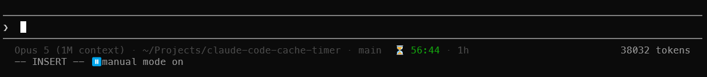

# claude-code-cache-timer

A Claude Code status line segment that counts down the time left on your session's
prompt cache.





When the cache lapses, the next turn re-writes the entire prompt prefix at 1.25x
(5-minute cache) or 2x (1-hour cache) the base input rate. Nothing in the UI tells you
how much time is left, so you can't tell whether to keep typing now or go make coffee.

| Display | Meaning |
|---|---|
| `⏳ 52:18 · 1h` green | over half the TTL remains |
| `⏳ 21:04 · 1h` yellow | between a fifth and a half |
| `⏳ 3:41 · 1h` red | under a fifth, spend it or lose it |
| `❄️ cold` | expired; the next turn pays to rewrite the prefix |
| `cache ?` | no cache write on record yet, TTL unknown |

Configuring any status line replaces Claude Code's built-in one, so the model, directory
and branch it used to show would otherwise vanish. They are redrawn here, dimmed, ahead of
the countdown. If you are wrapping an existing status line, that command already draws the
row and the prefix is left off.

The branch is read straight out of `.git/HEAD` rather than by running `git`, which costs
7 µs instead of 780 µs. Linked worktrees and submodules, whose `.git` is a pointer file
rather than a directory, are followed; a detached HEAD shows a short SHA.

## Install

Requires Python 3.8 or newer. Linux, macOS, and Windows. No dependencies.

```sh
uv tool install git+https://github.com/GabrielAndreiPreda/claude-code-cache-timer
# or: pipx install git+https://github.com/GabrielAndreiPreda/claude-code-cache-timer

claude-cache-timer install
```

Then open a new Claude Code session. To preview without writing anything, use
`--dry-run`.

If the shell cannot find `claude-cache-timer` after the first command, run `uv tool
update-shell` (or `pipx ensurepath`) and open a new terminal before the second. The
installer needs the name on PATH and stops with that same advice if it is missing,
without touching `settings.json`.

The status line command it writes is just that name. A name has no path separators, no
spaces and nothing any shell treats specially, so it runs the same whether Claude Code
routes the status line through Git Bash, PowerShell or `sh`, and none of them has to be
identified first. That is why the installer insists on the name rather than falling back
to an absolute path, which would have to be quoted for a shell it cannot inspect.

WSL and Windows are separate environments with separate home directories, so a Claude Code
you run in each needs its own install.

The installer adds a `statusLine` entry to `~/.claude/settings.json` and copies the old
file into `~/.claude/backups/` first. It changes nothing else and leaves your hooks and
permissions alone.

Claude Code allows comments and trailing commas in `settings.json`, which Python's JSON
parser rejects. If your file has either, the installer stops without touching it and
prints the block to paste in yourself, rather than rewriting the file and stripping your
comments.

Only one status line can be active at a time. If you already have one, the installer stops
and shows it rather than discarding it; pass `--force` to replace it.

Options:

| Flag | Effect |
|---|---|
| `--ascii` | use `~` and `*` instead of emoji, for terminals that render them badly |
| `--interval N` | seconds between refreshes (default 1) |
| `--dry-run` | verify and print the change without writing |
| `--force` | replace an existing status line that is not this one |

```sh
claude-cache-timer uninstall
uv tool uninstall claude-code-cache-timer   # or: pipx uninstall ...
```

## How it works

Only one quantity matters: when this session last made an API call. Every call that hits
the cache resets the TTL.

```
remaining = ttl - (now - last_api_call)
```

The clock is the timestamp on the last assistant turn in the transcript
`~/.claude/projects/<slug>/<session_id>.jsonl`. Only assistant turns carry a `usage`
block and only a response from the API produces one, so that timestamp advances on every
call the session makes, including the many that no hook reports.

It deliberately is not the last *record*. Most of what a transcript logs is local, and
much of it is timestamped, so a clock keyed to the newest record of any kind restarts on
things that cost nothing: run `/exit` or `/clear` and the countdown jumps back to full
on a cache that is still draining. The file's own mtime is wrong the same way, and
worse — Claude Code touches transcripts long after a session's last call, so an idle
session reports most of an hour left on a cache that went cold days ago.

Subagents come out right for free. They write to a `subagents/` subdirectory, and their
calls do not refresh the parent's cache. So while a subagent runs, the parent transcript
stalls and the countdown keeps draining, which is what you want to see. "The agent
is busy, so the cache must be fine" is wrong: a long-running subagent, a long build, or a
permission prompt you walked away from all drain the cache while the session looks like
it's working.

The TTL is read, never assumed. Sessions run on either the 5-minute or the 1-hour cache,
and can move between them mid-session. The transcript says which:

```json
"cache_creation": { "ephemeral_1h_input_tokens": 19627, "ephemeral_5m_input_tokens": 0 }
```

A hardcoded 5-minute countdown is wrong by a factor of 12 on a 1-hour session. The script
walks the transcript tail backwards for the newest non-zero bucket, re-reading every tick.
Turns that only read the cache record `{0, 0}`, so those get skipped rather than mistaken
for an answer.

There are no hooks and no state file. Everything needed arrives in the status line's own
stdin payload (`transcript_path`, `model.display_name`, `workspace.current_dir`), once a
second via `refreshInterval`.
[CACHE-MECHANISM.md](CACHE-MECHANISM.md) documents all of this in full.

## Limitations

Claude Code hides the status line during permission dialogs, autocomplete, and the help
menu. That is precisely when you are most likely to be idling the cache away, and the
number is invisible for it. Covering that case would need a separate always-on ticker
outside Claude Code.

The number reads optimistic by up to one response duration. The TTL restarts when a
request is sent, but the transcript is written when the response completes. On a slow turn
the display runs high by the length of that turn, which is negligible against an hour and
worth knowing against five minutes.

Each session spawns one process per second. That costs about 19 ms on Linux, of which
about 12 ms is Python interpreter startup that no amount of tuning inside the script can
recover; several times more on Windows, where process creation and Python startup are both
slower. Raise `refreshInterval` to `2` in `settings.json` if you would rather.

The status line also requires that you have accepted the workspace trust dialog, the same
gate that applies to hooks.

## Tests

```sh
python3 -m unittest discover -s tests
```

78 tests covering TTL detection (both buckets, mid-session changes, records too large for
the tail window), the clock (including a transcript touched long after its last call, and
the local records that must not reset it), the colour bands, graceful degradation on
every malformed input, branch
reading (worktrees, submodules, detached HEAD), the install and uninstall round trip, and
the command forms.

Whichever form it settles on, the installer runs it against a synthetic payload before
writing anything, so a broken command fails loudly at install time instead of leaving you
a silently blank status line.

## License

GNU GPL v3.0
